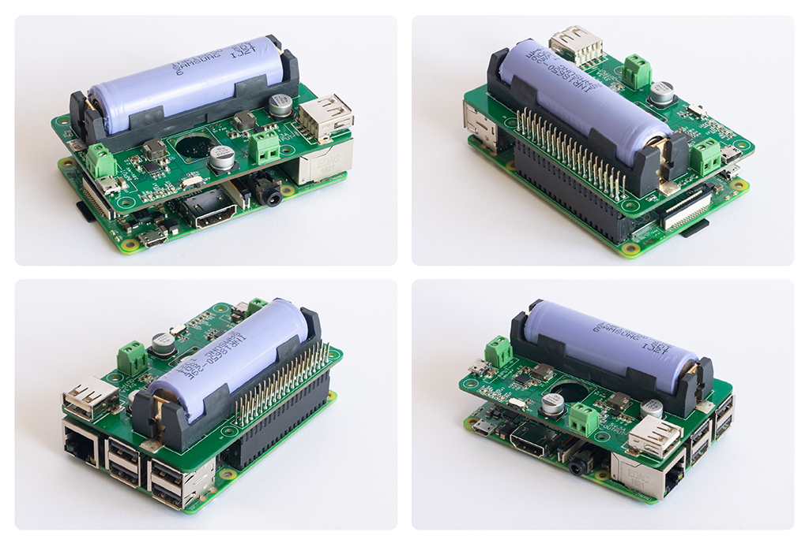
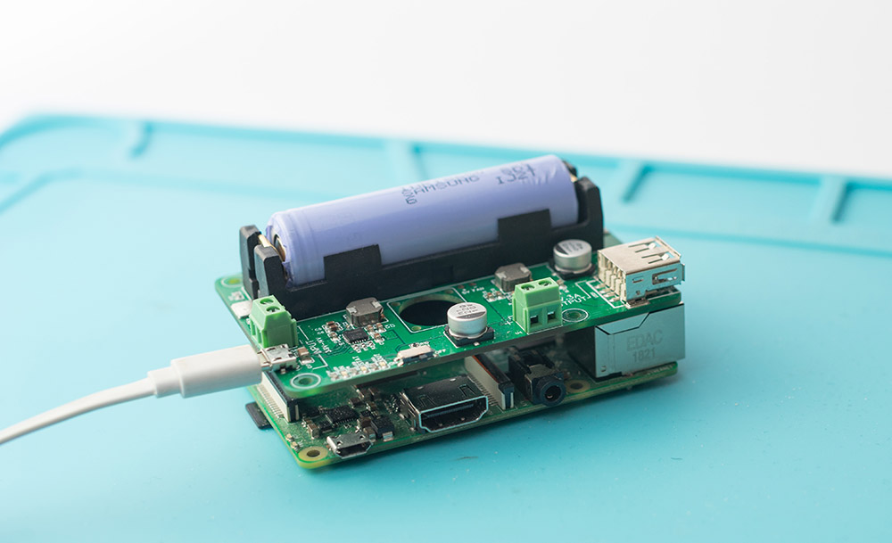
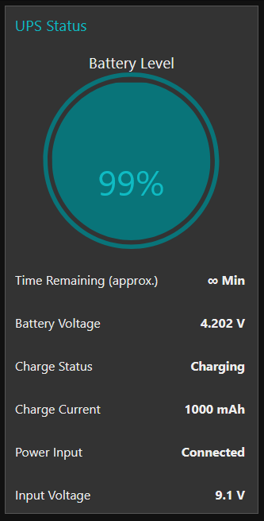
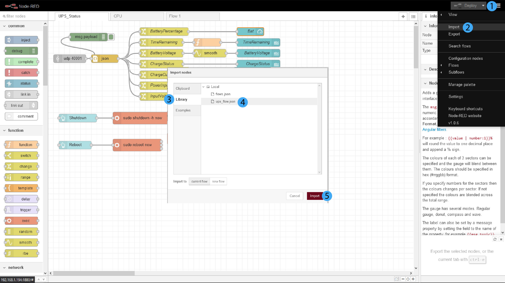

# UPS for Raspberry Pi



## Description

An uninterruptible power supply for Raspberry Pi that can provide more than an hour of backup power and can shutdown the Pi safely.
This UPS can be used to power any 5V device with up to 3A continuous current. It is based on Texas Instruments [BQ25895](http://www.ti.com/product/BQ25895) power management IC and [TPS61236P](http://www.ti.com/product/TPS61236P) boost converter IC.

This UPS can power a Raspberry Pi through the GPIO header by using it as a hat. When used as a hat, the GPIO pins 2, 3 and 4 will be utilized for I2C and interrupt signals.

Note:  

* Do not connect two input sources together!

* The device does not have reverse polarity protection, be sure to observe the polarity marked in the battery holder while inserting the battery.

* UPS script was tested on a Raspberry Pi 3B+ running Raspbian Buster.

## Specifications

* Input:  4.5V - 14V DC, 2A - 5A

* Input Ports: Screw Terminal, micro USB

* Output: 5V, up to 3A

* Output Ports: Screw Terminal, USB A, 40 pin GPIO header for Raspberry Pi

* Battery: Samsung INR18650-29E Recommended (Other 18650 size batteries can be used)

* Communication: I2C

## Status LEDs

* IN: Input connected or not

* STATUS: ON- Charging, OFF- Charging done, Blinking- Error

* OUT: Output on or off

## Setting up Power Pi for use with a Raspberry Pi

### 1. Connect Power Pi to Raspberry pi

* Make sure the switch of the Power Pi is turned off and no power input is connected to the Power Pi.

* Insert the battery into the battery holder of the Power Pi following the correct polarity.

* Connect Power Pi to Raspberry Pi by inserting it into the GPIO pins.

* Connect a USB power cable into the Raspberry Pi's USB input as usual to turn the Pi on. (This is to set up Power Pi. After the setup, power cable can be connected to Power Pi's input.)


### 2. Set up Raspberry Pi to communicate with Power Pi

#### Enable I2C and install smbus

Update the system (optional):

```shell
sudo apt update && sudo apt upgrade -y
```

Enable I2C:

```shell
sudo raspi-config
```

Choose Interfacing Options, then I2C and then select enable to enable I2C in the Raspberry Pi.

Install smbus by running the following command:

```shell
sudo apt-get install -y python-smbus
```

For more information, checkout the [link](https://learn.adafruit.com/adafruits-raspberry-pi-lesson-4-gpio-setup/configuring-i2c)

### 3. Install the ups service

Clone the Power Pi repository:

```shell
cd ~
git clone https://github.com/tjohn327/raspberry_pi_ups.git
cd raspberry_pi_ups/src/
git checkout R3_1
```

Edit the file powerpi.py between lines 16 and 24 if you are not using Samsung INR18650-29E battery. It is recommended to keep the VBAT_LOW at 3.2V for Li-Ion batteries.

*Power PI uses GPIO4 for interrupts from the Power Management IC. 1-Wire interface uses the same pin. If you are not using 1-Wire interface, disable it before proceeding. Power Pi can still function fully without the interrupt. So if you want to use 1-Wire interface it is advised to remove the resistor R12 from Power Pi, otherwise it will cause interference with 1-Wire interface.*

Run the install.sh script to install a service for the ups.

```shell
chmod +x install.sh
./install.sh
```

This creates a service named ups.service that will run on startup.
If there are no errors, you will see this as the output:

```shell
Checking Python
Python found
Initializing Power Pi
INFO:root:UPS initialized
Creating ups service
Enabling ups service to run on startup
ups service enabled
Power Pi configured successfully
```

Now turn off the Raspberry Pi and remove the power cable form it. Connect the power cable to Power Pi and turn the switch to ON position. This will power up the Raspberry Pi through Power Pi.



When the Pi is powered back up, check the status of the ups service by running:

```shell
sudo systemctl status ups.service
```

If everything is running correctly, you will see a status similar to this:

```shell
● ups.service - UPS Service
   Loaded: loaded (/lib/systemd/system/ups.service; enabled; vendor preset: enabled)
   Active: active (running) since Tue 2020-06-09 06:44:15 UTC; 34s ago
 Main PID: 542 (python)
    Tasks: 2 (limit: 2200)
   Memory: 6.9M
   CGroup: /system.slice/ups.service
           └─542 /usr/bin/python /home/pi/code/raspberry_pi_ups/src/ups.py

Jun 09 06:44:15 raspberrypi systemd[1]: Started UPS Service.
Jun 09 06:44:17 raspberrypi python[542]: INFO:root:UPS initialized
```

Your Power Pi is now ready.

The ups service will now run on startup and send the status of the UPS to UDP Port 40001 every 2 seconds. You can see the status of the UPS by listening to that port.

To test if the UPS status is being read correctly, run the following command:

```shell
nc -lvu  40001
```

### 4. Setup Node-Red dashboard for visualization (optional)



If you are new to Node-Red, please checkout their Essentials [video](https://www.youtube.com/watch?v=ksGeUD26Mw0&list=PLyNBB9VCLmo1hyO-4fIZ08gqFcXBkHy-6) series.

Follow the instructions given in the [link](https://nodered.org/docs/getting-started/raspberrypi) and install Node-Red on the Raspberry Pi.

It may take a while to install. After the installation is done, copy the ups_flow.json file to Node-Red's directory.

```shell
cp ups_flow.json ~/.node-red/lib/flows/ups_flow.json
```

Install the Dashboard extension for Node-Red.

```shell
cd ~/.node-red/
npm i node-red-dashboard
```

Enable Node-Red to run on startup and start the Node-Red service:

```shell
sudo systemctl enable nodered.service
sudo systemctl start nodered.service
```

Open the Node-Red link in a browser. The link is usually:

http://[IP of Raspberry Pi]:1880/

Import the ups flow into the Node-Red environment.



Edit one of the UI nodes (e.g BAT) by double clicking on it. In its setup menu click on the edit button next to "Group' and select 'Home' in the Tab drop down. Click Update and then Done.

Deploy the flow by clicking the Deploy button and open the dashboard link of Node-Red to see the status of the UPS.

http://[IP of Raspberry Pi]:1880/ui

More [info](https://nodered.org/docs/user-guide/editor/workspace/import-export) about importing flows and setting up [dashboards](https://flows.nodered.org/node/node-red-dashboard).

## Using Power Pi with Raspberry Pi

When powering the Raspberry Pi through Power Pi, always connect the power cable to the input of the Power Pi. Use the switch of Power Pi to turn the devices ON and OFF.
